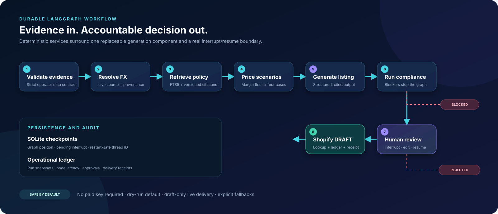
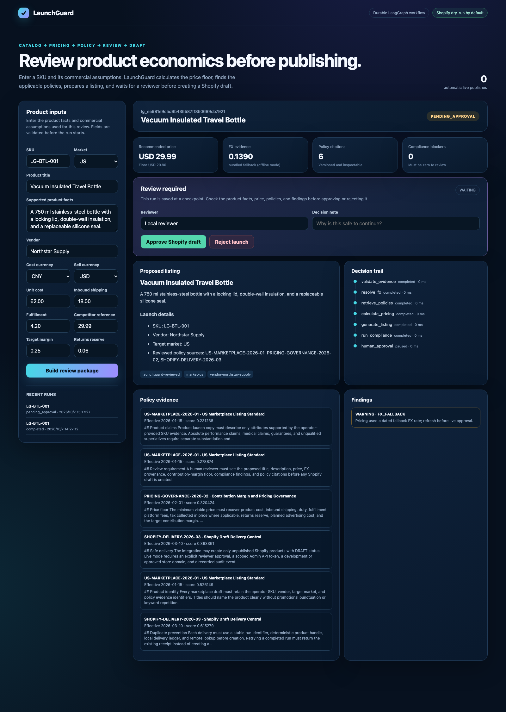

<div align="center">

# LaunchGuard AI

**A reviewable product-launch workflow for pricing, policy checks, and Shopify drafts.**

[](https://www.python.org/)
[](https://github.com/langchain-ai/langgraph)
[](https://github.com/Jack81st/launchguard-ai/actions/workflows/ci.yml)
[](#quality-evidence)
[](#shopify-safety)
[](LICENSE)

[Quickstart](#quickstart) · [Architecture](docs/architecture.md) · [Engineering Report](docs/engineering-report.md) · [Threat Model](docs/threat-model.md) · [Roadmap](docs/roadmap.md) · [Contributing](CONTRIBUTING.md)

</div>

---

## The problem

A supplier record can become a product listing before anyone has checked the margin assumptions, applicable policies, or approval history. LaunchGuard keeps those decisions in one traceable workflow:

```text
catalog and cost inputs
→ sourced FX rate
→ versioned policy citations
→ contribution-margin scenarios
→ structured listing draft
→ deterministic compliance checks
→ durable human review
→ idempotent Shopify DRAFT
```

LaunchGuard works from catalog and cost data supplied by the operator. It does not estimate demand or marketplace sales. If required evidence or approval is missing, the run stops before Shopify delivery.



## How it works

| Design choice | Implementation | Operational value |
|---|---|---|
| Checkpointed review | LangGraph `interrupt()` plus SQLite checkpoints and stable thread IDs | A run can pause, survive process restart, and resume after review |
| Deterministic business rules | FX, pricing, retrieval, compliance, persistence, and delivery use explicit services | Calculations and controls remain inspectable and testable |
| Traceable inputs | Strict CSV/JSON SKU contract with a source reference | Reviewers can see where the commercial assumptions came from |
| Versioned policy retrieval | SQLite FTS5, market filters, effective dates, source paths, and citation IDs | Reviewers can inspect exactly which rule supported the draft |
| Unit economics | Duty, shipping, fulfillment, fees, VAT, returns, ads, margin, FX, and four stress scenarios | Makes commercial feasibility visible before copy is approved |
| Draft-only delivery | Dry-run default, explicit review, deterministic handle, remote lookup, local ledger, Shopify `DRAFT` status | Reduces accidental publishing and duplicate products |
| Evaluation gate | Reproducible cases for clean launches, commercial warnings, and prompt-injection blocking | Changes can be measured instead of judged only by demos |

## Control room



Use the control room to start a launch review, compare the recommended price with its floor, inspect the FX source and policy citations, and approve or reject the draft. Runs waiting for review remain available after a restart.

## Quickstart

### Local Python

```bash
git clone https://github.com/Jack81st/launchguard-ai.git
cd launchguard-ai
python3 -m venv .venv
source .venv/bin/activate
python -m pip install -e ".[dev]"
launchguard serve
```

Open [http://127.0.0.1:8080](http://127.0.0.1:8080). The default setup works without model or Shopify credentials.

### Docker

```bash
docker compose up --build
```

SQLite run history and checkpoints are stored in the `launchguard-data` volume.

## Durable CLI review

Start an offline demonstration run:

```bash
launchguard start \
  --catalog examples/catalog.csv \
  --sku LG-BTL-001 \
  --offline
```

The command returns a `run_id` and exits with `pending_approval`. The process can now stop. Resume the same checkpoint later:

```bash
launchguard decide \
  --run-id lg_your_run_id \
  --action approve \
  --reviewer "Operations reviewer" \
  --note "Evidence, margin floor, and policy citations reviewed"
```

Reusing a completed `run_id` does not create another delivery.

## Pricing model

LaunchGuard solves the price required to preserve the target contribution margin:

```text
fixed cost = converted product cost + converted inbound shipping + duty + fulfillment

minimum price = fixed cost /
  (1 - platform fee - VAT - returns reserve - ad cost - target margin)
```

Each review includes:

- base economics;
- 3% adverse FX movement;
- +2 percentage points in returns;
- +1 percentage point in platform fees.

The pricing result is decision support, not a forecast. Every input appears in the review package so the assumptions can be checked before approval.

## Policy retrieval and generation

Policies are Markdown files with required metadata:

```yaml
---
id: PRICING-GOVERNANCE-2026-02
title: Contribution Margin and Pricing Governance
market: GLOBAL
effective_date: 2026-02-01
---
```

SQLite FTS5 retrieves market-appropriate sections and returns the document ID, effective date, source path, content, and score. The default listing builder is deterministic. An OpenAI-compatible endpoint can be enabled for model-written copy, but the response must still pass schema validation and may cite only retrieved evidence IDs.

## Shopify safety

Live delivery is unavailable unless all of these conditions are true:

1. deterministic checks report no blockers;
2. the graph is resumed with an explicit named reviewer decision;
3. `LAUNCHGUARD_SHOPIFY_MODE=live` is configured;
4. a valid `*.myshopify.com` domain and Admin API token are present.

The connector then:

- checks the local delivery ledger;
- looks up the deterministic handle remotely;
- creates a product with `DRAFT` status only;
- updates the initial variant price;
- records the remote ID, handle, payload hash, and receipt.

Rate limits and transient server failures are retried. GraphQL user errors and partial price-update failures are surfaced rather than converted into success.

## Quality evidence

```bash
make lint
make test
make eval
```

CI runs on Python 3.9, 3.11, and 3.12, enforces at least 80% branch-aware coverage, executes the evaluation gate, and builds the production container. Tests use mock transports and never need paid credentials.

Current verification results:

- 34 automated tests passing;
- 83.76% branch-aware coverage;
- 3/3 evaluation cases passing;
- 100% decision accuracy, pricing-floor pass rate, and citation coverage on the bundled evaluation set;
- one browser acceptance test from catalog input to checkpointed approval and an idempotent Shopify dry-run receipt.

These figures measure the repository's test and regression suite; they do not measure commercial lift. The bundled evaluation reports:

- decision accuracy;
- pricing-floor pass rate;
- policy citation coverage;
- per-case compliance codes.

See the [engineering report](docs/engineering-report.md) for the design rationale, verification scope, and known limitations.

## API

FastAPI exposes:

| Method | Endpoint | Purpose |
|---|---|---|
| `POST` | `/api/runs` | Validate evidence and run until completion or review interrupt |
| `GET` | `/api/runs` | List recent runs |
| `GET` | `/api/runs/{run_id}` | Read persisted state and audit events |
| `POST` | `/api/runs/{run_id}/decision` | Resume a pending checkpoint with approve/reject and optional edits |
| `GET` | `/health` | Container and service health |

Interactive OpenAPI documentation is available at `/docs`.

## Repository layout

```text
src/launchguard/
├── api.py                    # FastAPI and control-room API
├── workflow.py               # LangGraph, interrupt, resume, checkpointing
├── models.py                 # Strict evidence and output contracts
├── store.py                  # Run, event, approval, and delivery ledger
├── connectors/
│   ├── catalog.py            # Validated CSV catalog input
│   ├── fx.py                 # Live FX with explicit fallback provenance
│   └── shopify.py            # Guarded GraphQL draft delivery
└── services/
    ├── policies.py           # Versioned FTS5 retrieval
    ├── pricing.py            # Unit economics and stress scenarios
    ├── generation.py         # Deterministic and optional LLM generation
    └── compliance.py         # Deterministic safety and policy checks
```

## Honest boundaries

- Bundled policy files are examples, not legal advice or current marketplace terms.
- The fallback FX table is dated and raises a warning whenever it is used.
- The project does not estimate demand, sales, or conversion.
- Live Shopify behavior requires a development store and should be tested there first.
- Authentication, RBAC, encrypted secrets, and centralized audit retention remain required before multi-user production use.

## Originality and license

This repository started with an empty Git history. It is not a fork and contains no BorderPilot source code, assets, history, or documentation. LaunchGuard uses open-source libraries through their documented APIs and is released under the [MIT License](LICENSE).
